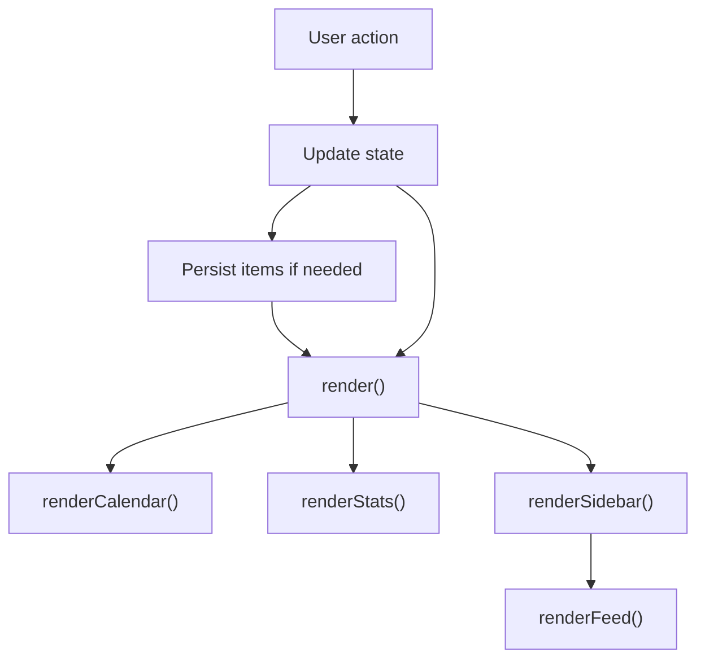

# Architecture

## Application Type

Task Calendar is a static single-page application implemented with Vite and React. It uses browser APIs for local persistence and builds to static assets for GitHub Pages.

## Runtime Components

| Component | File | Responsibility |
| --- | --- | --- |
| Redirect page | `index.html` | Sends users to `taskcalendar.html`. |
| Planner app | `src/App.jsx` | Renders UI, handles events, manages state, and persists data through storage. |
| App entry | `src/main.jsx` | Mounts the React application. |
| Styles | `src/styles.css` | Defines the visual system and responsive layout. |
| Storage adapter | `src/storage/` | Encapsulates persistence behavior. |
| Static server | `server.js` | Legacy helper for serving static files during local development. |
| Browser storage | `localStorage` | Stores tasks and notes on the user's device. |

## Client-Side State

Runtime state is held in React state inside `src/App.jsx`.

| Field | Purpose |
| --- | --- |
| `currentMonth` | First day of the visible calendar month. |
| `selectedDate` | Selected day in `YYYY-MM-DD` format. |
| `mode` | Active sidebar mode: `tasks` or `notes`. |
| `items` | Persisted task and note records. |
| `searchQuery`, `taskFilter` | Feed search and filtering controls. |
| `swipe` | Gesture tracking for month swipes. |

## Data Model

Tasks and notes are stored together in `state.items`.

### Task

```json
{
  "id": "uuid",
  "date": "YYYY-MM-DD",
  "type": "task",
  "title": "Pay invoice",
  "description": "Optional details",
  "priority": "normal",
  "status": "open",
  "dueDate": "YYYY-MM-DD",
  "reminderTime": "09:00",
  "startDate": "YYYY-MM-DD",
  "startTime": "09:30",
  "durationMinutes": "30",
  "completionTime": "",
  "parentId": "",
  "tags": ["tag-id"],
  "links": [{ "kind": "note", "id": "uuid" }],
  "done": false,
  "createdAt": 1777093200000
}
```

### Note

```json
{
  "id": "uuid",
  "date": "YYYY-MM-DD",
  "type": "note",
  "title": "",
  "description": "Meeting notes",
  "priority": "normal",
  "status": "open",
  "dueDate": "YYYY-MM-DD",
  "reminderTime": "",
  "startDate": "YYYY-MM-DD",
  "startTime": "",
  "durationMinutes": "",
  "completionTime": "",
  "parentId": "",
  "tags": ["tag-id"],
  "links": [{ "kind": "task", "id": "uuid" }],
  "done": false,
  "createdAt": 1777093200000
}
```

### Routine

Routines use the same common fields as tasks and notes, plus recurrence fields such as `daysOfWeek`. Routine links use:

```json
{ "kind": "routine", "id": "routine-id" }
```

Tasks, notes, and routines can link to each other through the shared `links` array.

## Persistence

The app persists all planner records through `src/storage/localStorageAdapter.js` in browser `localStorage` under:

```text
task-calendar-v2
```

This keeps data available across browser refreshes on the same browser profile. Clearing browser site data removes stored tasks and notes.

## Rendering Flow



## Event Flow

| Event | Handler | Outcome |
| --- | --- | --- |
| Previous month button | `changeMonth(-1)` | Moves visible month backward. |
| Next month button | `changeMonth(1)` | Moves visible month forward. |
| Today button | `selectDate(today)` | Selects today's date. |
| Calendar day click | `selectDate(key)` | Selects clicked day. |
| Swipe left | `changeMonth(1)` | Moves to next month. |
| Swipe right | `changeMonth(-1)` | Moves to previous month. |
| Add task/note | `addItem()` | Adds record and saves to storage. |
| Toggle task | `toggleDone(id)` | Toggles completion. |
| Delete item | `deleteItem(id)` | Removes record. |
| Clear done | `clearDone()` | Removes completed tasks for selected day. |

## Security and Privacy

- Data is stored locally in the browser.
- No application data is sent to a backend by the app.
- User-entered content is escaped before being rendered into item cards.
- The local server is bound to `127.0.0.1`.

## Known Technical Debt

- The GitHub adapter is designed but not implemented yet.
- There is no automated browser test suite.
- There is no formal schema migration process for local storage.
- No offline asset caching beyond the minimal service worker registration.

## GitHub Pages Target Architecture

The long-term deployable architecture is documented in:

- [High-Level Design: GitHub Pages Deployable Planner](HLD_GITHUB_PAGES.md)
- [Low-Level Design: GitHub Pages Deployable Planner](LLD_GITHUB_PAGES.md)

The key constraint is that GitHub Pages cannot run `server.js` or write JSON files directly. Future persistence should be implemented through static-compatible storage adapters.
