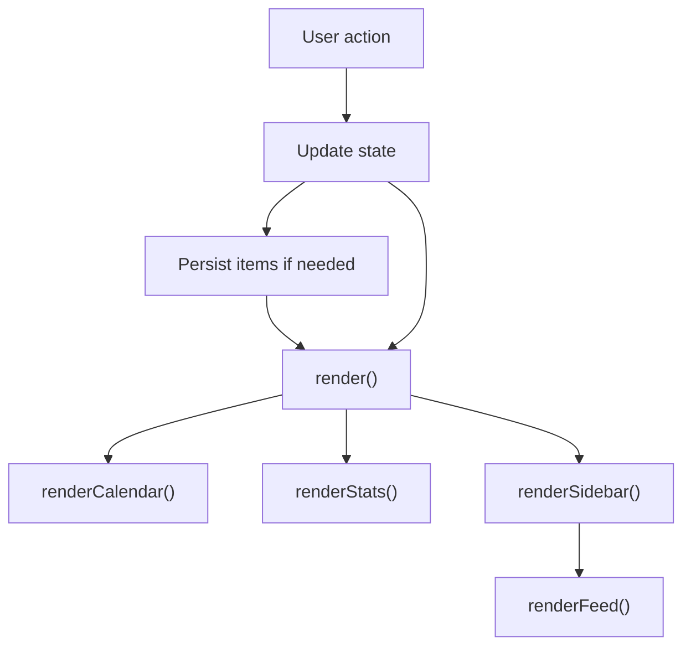

# Architecture

## Application Type

Task Calendar is a static single-page application implemented in one HTML file. It uses native browser APIs and does not require a framework or build system.

## Runtime Components

| Component | File | Responsibility |
| --- | --- | --- |
| Redirect page | `index.html` | Sends users to `taskcalendar.html`. |
| Planner app | `taskcalendar.html` | Renders UI, handles events, manages state, and persists data. |
| Static server | `server.js` | Serves files during local development. |
| Browser storage | `localStorage` | Stores tasks and notes on the user's device. |

## Client-Side State

Runtime state is held in a single `state` object inside `taskcalendar.html`.

| Field | Purpose |
| --- | --- |
| `current` | First day of the visible calendar month. |
| `selected` | Selected day in `YYYY-MM-DD` format. |
| `mode` | Active sidebar mode: `tasks` or `notes`. |
| `items` | Persisted task and note records. |
| `swipeStartX`, `swipeStartY`, `swipeTracking` | Gesture tracking for month swipes. |

## Data Model

Tasks and notes are stored together in `state.items`.

### Task

```json
{
  "id": "uuid",
  "date": "YYYY-MM-DD",
  "type": "task",
  "title": "Pay invoice",
  "text": "Optional details",
  "time": "09:30",
  "priority": "normal",
  "done": false,
  "createdAt": 1777093200000
}
```

### Note

```json
{
  "id": "uuid",
  "date": "YYYY-MM-DD",
  "type": "note",
  "title": "",
  "text": "Meeting notes",
  "time": "",
  "priority": "normal",
  "done": false,
  "createdAt": 1777093200000
}
```

## Persistence

The app persists all planner records in browser `localStorage` under:

```text
task-calendar-v2
```

This keeps data available across browser refreshes on the same browser profile. Clearing browser site data removes stored tasks and notes.

## Rendering Flow



## Event Flow

| Event | Handler | Outcome |
| --- | --- | --- |
| Previous month button | `changeMonth(-1)` | Moves visible month backward. |
| Next month button | `changeMonth(1)` | Moves visible month forward. |
| Today button | `selectDate(today)` | Selects today's date. |
| Calendar day click | `selectDate(key)` | Selects clicked day. |
| Swipe left | `changeMonth(1)` | Moves to next month. |
| Swipe right | `changeMonth(-1)` | Moves to previous month. |
| Add task/note | `addItem()` | Adds record and saves to storage. |
| Toggle task | `toggleDone(id)` | Toggles completion. |
| Delete item | `deleteItem(id)` | Removes record. |
| Clear done | `clearDone()` | Removes completed tasks for selected day. |

## Security and Privacy

- Data is stored locally in the browser.
- No application data is sent to a backend by the app.
- User-entered content is escaped before being rendered into item cards.
- The local server is bound to `127.0.0.1`.

## Known Technical Debt

- The main app is contained in a single large HTML file.
- There is no automated browser test suite.
- There is no formal schema migration process for local storage.
- No offline asset caching beyond the minimal service worker registration.
