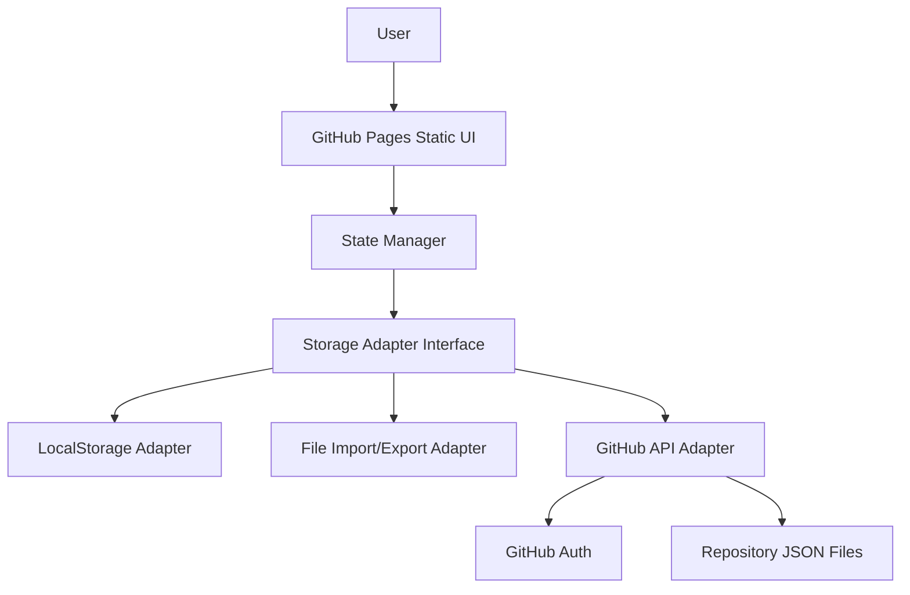
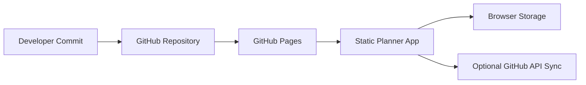

# High-Level Design: GitHub Pages Deployable Planner

## Objective

Evolve Task Calendar into a GitHub Pages deployable planner application while keeping the user experience smooth and the system maintainable as features grow.

## Key Constraint

GitHub Pages is a static hosting platform. It can serve HTML, CSS, JavaScript, images, and JSON assets, but it cannot run a Node server, write files, execute Git commands, or safely store private secrets.

That means these capabilities are not available directly on GitHub Pages:

- Writing task data into repository JSON files.
- Running `server.js`.
- Committing and pushing from the hosted app without an authenticated API flow.
- Hiding a GitHub token inside frontend code.

## Recommended Architecture

Use a static-first architecture with pluggable storage adapters.



## Storage Modes

| Mode | GitHub Pages Compatible | Writes to GitHub | Complexity | Recommended Use |
| --- | --- | --- | --- | --- |
| LocalStorage | Yes | No | Low | Default MVP and offline personal use. |
| JSON import/export | Yes | Manual | Low-medium | Backup, restore, profile transfer. |
| GitHub API sync | Yes | Yes | Medium-high | Repository-backed profiles. |
| Separate backend | No, requires external service | Optional | High | Multi-user, secure, scalable app. |

## Recommended Product Path

### Phase 1: Static App Foundation

- Keep the app fully GitHub Pages deployable.
- Split code into maintainable files.
- Keep `localStorage` as default persistence.
- Add import/export for JSON backups.
- Add automated static checks.

### Phase 2: Multi-Profile Local Data

- Add profile switcher.
- Store multiple profiles in `localStorage`.
- Add export and import per profile.
- Keep the app usable offline.

### Phase 3: GitHub Repository Sync

- Add GitHub API adapter.
- Use user-provided GitHub auth, never hard-coded tokens.
- Store JSON files under:

  ```text
  data/profiles/
  ```

- Use explicit user-triggered sync:
  - Pull latest.
  - Save local.
  - Push to GitHub.

### Phase 4: Conflict Handling

- Track profile revision metadata.
- Detect remote changes before upload.
- Offer conflict choices:
  - Keep local.
  - Use remote.
  - Save copy.
  - Manual merge later.

### Phase 5: Advanced Planner Features

- Recurring tasks.
- Tags and categories.
- Week and agenda views.
- Task editing.
- Drag-and-drop ordering.
- Reminders through browser notifications where supported.

## Deployment Architecture



## Repository Structure Target

```text
/
  index.html
  taskcalendar.html
  assets/
    styles.css
    app.js
    calendar.js
    state.js
    storage/
      localStorageAdapter.js
      jsonFileAdapter.js
      githubAdapter.js
  data/
    profiles/
      example-profile.json
  docs/
```

## Smooth Complexity Handling

Use these boundaries to prevent the application from becoming hard to manage:

- UI components should not directly call storage APIs.
- Storage should go through one adapter interface.
- Date formatting and calendar math should live in a calendar utility module.
- State updates should go through one state manager.
- GitHub sync should be an optional feature, not required for normal use.
- User-triggered sync should be preferred over automatic background sync at first.

## Security Model

For GitHub Pages:

- Do not commit personal access tokens.
- Do not store long-lived tokens in source code.
- Prefer GitHub OAuth device flow, fine-grained tokens, or manual token entry stored only in browser storage if necessary.
- Clearly label sync actions because they write data to a GitHub repository.
- Treat repository visibility as the data privacy boundary.

## Data Privacy Model

| Storage Location | Privacy Boundary |
| --- | --- |
| Browser `localStorage` | Current browser profile and device. |
| Downloaded JSON export | User's local file system. |
| GitHub private repository | GitHub account and repository collaborators. |
| GitHub public repository | Public internet. |

## Operational Model

| Operation | Default Behavior |
| --- | --- |
| App load | Load selected profile from browser storage. |
| Add task/note | Save immediately to local profile. |
| Export | Download selected profile as JSON. |
| Import | Validate JSON and merge or replace selected profile. |
| Pull from GitHub | Fetch profile JSON through GitHub API. |
| Push to GitHub | Commit selected profile JSON through GitHub API. |

## Risks

| Risk | Mitigation |
| --- | --- |
| Token exposure | Never hard-code tokens; document auth clearly. |
| GitHub API rate limits | Sync manually and batch writes. |
| Many commits from autosave | Use explicit sync button instead of syncing every change. |
| Data conflicts | Compare remote revision before push. |
| Large single file | Split JS and CSS before adding GitHub sync. |
| Public data leak | Warn users when syncing to public repos. |

## Recommendation

The Vite and React migration is now the baseline. The next implementation step is to add JSON import/export through the storage adapter model. This keeps it GitHub Pages compatible and prepares the codebase for GitHub-backed profiles without introducing authentication complexity too early.
