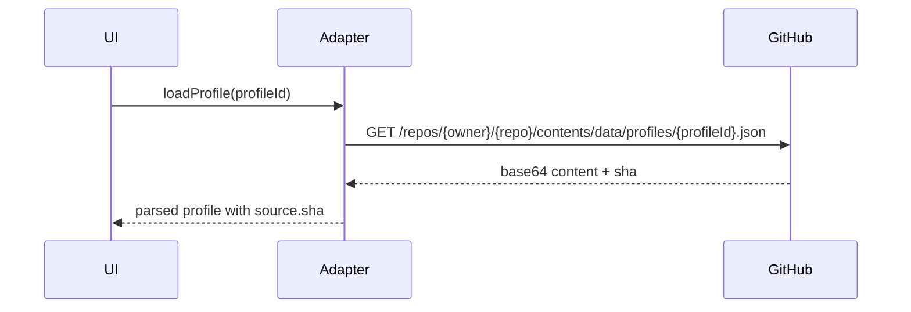
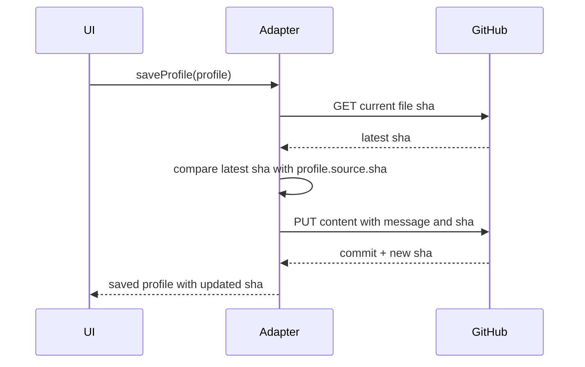

# Low-Level Design: GitHub Pages Deployable Planner

## Scope

This document describes the low-level design for making Task Calendar maintainable, GitHub Pages deployable, and ready for optional GitHub-backed JSON profiles.

## Static App File Design

Current file split:

```text
index.html
src/App.jsx
src/main.jsx
src/styles.css
src/utils/date.js
src/storage/index.js
src/storage/localStorageAdapter.js
```

## Module Responsibilities

| Module | Responsibility |
| --- | --- |
| `src/main.jsx` | App bootstrap and React mount. |
| `src/App.jsx` | App state, rendering, event wiring, mutations, and selectors. |
| `src/utils/date.js` | Date keys, month generation, and date formatting. |
| `storage/index.js` | Storage adapter contract and active adapter selection. |
| `localStorageAdapter.js` | Default browser storage implementation. |
| `importExportAdapter.js` | Planned adapter for downloading and uploading profile JSON files. |
| `githubAdapter.js` | Planned adapter for optional GitHub API read/write implementation. |
| `src/styles.css` | All styling and responsive behavior. |

## Core Data Model

### App State

```json
{
  "activeProfileId": "personal",
  "currentMonth": "2026-04",
  "selectedDate": "2026-04-25",
  "mode": "tasks",
  "searchQuery": "",
  "taskFilter": "all",
  "profiles": {}
}
```

### Profile

```json
{
  "schemaVersion": 1,
  "profileId": "personal",
  "displayName": "Personal",
  "createdAt": "2026-04-25T05:00:00.000Z",
  "updatedAt": "2026-04-25T05:10:00.000Z",
  "source": {
    "type": "local",
    "repo": null,
    "path": null,
    "sha": null
  },
  "items": []
}
```

### Task Item

```json
{
  "id": "uuid",
  "type": "task",
  "date": "2026-04-25",
  "title": "Finish planner",
  "text": "Document the GitHub Pages design",
  "time": "10:30",
  "priority": "high",
  "status": "open",
  "tags": ["docs"],
  "createdAt": "2026-04-25T05:00:00.000Z",
  "updatedAt": "2026-04-25T05:00:00.000Z"
}
```

### Note Item

```json
{
  "id": "uuid",
  "type": "note",
  "date": "2026-04-25",
  "title": "Architecture note",
  "text": "GitHub Pages cannot run the Node server.",
  "tags": ["architecture"],
  "createdAt": "2026-04-25T05:00:00.000Z",
  "updatedAt": "2026-04-25T05:00:00.000Z"
}
```

## Storage Adapter Contract

All persistence modes should implement the same interface.

```javascript
const storageAdapter = {
  async listProfiles() {},
  async loadProfile(profileId) {},
  async saveProfile(profile) {},
  async deleteProfile(profileId) {},
  async exportProfile(profileId) {},
  async importProfile(file) {}
};
```

## LocalStorage Adapter

### Keys

```text
task-calendar:profiles
task-calendar:profile:{profileId}
task-calendar:active-profile
```

### Behavior

- `listProfiles()` reads profile metadata from `task-calendar:profiles`.
- `loadProfile(profileId)` reads profile JSON by key.
- `saveProfile(profile)` writes full profile JSON.
- `deleteProfile(profileId)` removes the profile key and metadata.
- `exportProfile(profileId)` creates a downloadable JSON blob.
- `importProfile(file)` validates and stores imported JSON.

## Import/Export Adapter

### Export

1. Serialize selected profile.
2. Create JSON blob.
3. Trigger browser download.
4. File name format:

   ```text
   task-calendar-{profileId}-{YYYY-MM-DD}.json
   ```

### Import

1. User selects a JSON file.
2. Parse JSON.
3. Validate `schemaVersion`, `profileId`, and `items`.
4. Show merge or replace choice.
5. Save through active storage adapter.

## GitHub Adapter

### Repository Path

Profile files should be stored at:

```text
data/profiles/{profileId}.json
```

### Read Flow



### Write Flow



### Conflict Rule

If the remote `sha` differs from `profile.source.sha`, do not overwrite automatically.

Return:

```json
{
  "ok": false,
  "reason": "conflict",
  "localProfile": {},
  "remoteProfile": {}
}
```

The UI should offer:

- Keep local and overwrite remote.
- Use remote.
- Save local as a new profile.
- Cancel.

## GitHub API Endpoints

| Operation | Endpoint |
| --- | --- |
| Read profile | `GET /repos/{owner}/{repo}/contents/data/profiles/{profileId}.json` |
| Create/update profile | `PUT /repos/{owner}/{repo}/contents/data/profiles/{profileId}.json` |
| List profiles | `GET /repos/{owner}/{repo}/contents/data/profiles` |

## Authentication Design

Do not hard-code credentials.

Supported future options:

| Option | Fit | Notes |
| --- | --- | --- |
| User-provided fine-grained token | Simple | Store only in browser if user explicitly chooses. |
| GitHub OAuth app | Better UX | Requires OAuth app setup and redirect handling. |
| GitHub device flow | Good for CLI-like auth | Requires OAuth app configuration. |
| Backend token broker | Strongest | Not GitHub Pages-only. |

For the first GitHub sync release, use manual token entry with explicit warnings and support clearing the token.

## UI Components

| Component | Data Inputs | Actions |
| --- | --- | --- |
| Header | Active profile, selected date | Today, profile switcher, sync status |
| Calendar grid | Current month, items by date | Select date, swipe month |
| Day sidebar | Selected date, mode, filtered items | Add, delete, complete, clear done |
| Profile manager | Profile list | Create, rename, switch, export, import |
| Sync panel | GitHub repo settings, sync status | Pull, push, resolve conflicts |

## State Mutations

| Mutation | Inputs | Output |
| --- | --- | --- |
| `createProfile` | Display name | New empty profile. |
| `selectProfile` | Profile id | Loads profile and sets active id. |
| `addTask` | Date, title, metadata | Task added to active profile. |
| `updateTask` | Task id, patch | Task updated. |
| `completeTask` | Task id | Status changed to done. |
| `deleteItem` | Item id | Item removed. |
| `addNote` | Date, note fields | Note added. |
| `saveProfile` | Profile | Persists through adapter. |
| `syncProfile` | Profile id | Pushes or pulls through GitHub adapter. |

## Validation Rules

| Field | Rule |
| --- | --- |
| `profileId` | Lowercase slug, unique. |
| `date` | `YYYY-MM-DD`. |
| `type` | `task` or `note`. |
| `title` | Required for tasks. |
| `text` | Required for notes. |
| `priority` | `low`, `normal`, or `high`. |
| `status` | `open` or `done`. |
| `createdAt`, `updatedAt` | ISO timestamp. |

## GitHub Pages Deployment

### Branch Options

Use one of:

- Deploy from `main` branch root.
- Deploy from `/docs` folder.
- Deploy with GitHub Actions to `gh-pages`.

Recommended for this repo:

```text
Deploy from main branch root
```

Reason: the app currently lives at repository root and does not need a build step.

### Pages URLs

Expected pattern:

```text
https://mohanmurali-code.github.io/Task-calendar/
```

## Implementation Sequence

1. Split `taskcalendar.html` into static modules.
2. Add profile schema and validation.
3. Add multiple profiles using localStorage.
4. Add JSON export/import.
5. Add GitHub Pages deployment configuration.
6. Add optional GitHub API adapter.
7. Add conflict handling.
8. Add automated UI tests.

## Error Handling

| Error | UX |
| --- | --- |
| Invalid imported JSON | Show validation error and do not import. |
| GitHub auth failed | Show sign-in/token message. |
| GitHub rate limit | Show retry guidance. |
| Remote conflict | Show conflict resolution panel. |
| Storage quota exceeded | Offer export and cleanup guidance. |

## Non-Functional Requirements

| Area | Requirement |
| --- | --- |
| Deployability | Must run on GitHub Pages without server-side code. |
| Maintainability | UI, state, calendar logic, and storage must be separated before GitHub sync. |
| Privacy | No secrets in source code. |
| Resilience | Local work should not depend on GitHub availability. |
| Usability | Sync should be explicit and explain what repository/path is affected. |
